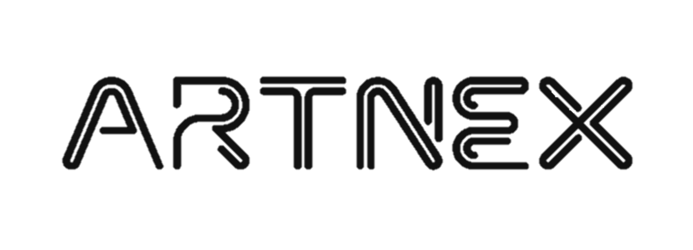

<p align="center">
  
</p>

# ArtNex: Tech, Art, Tomorrow! 🎆

ArtNex is a deep learning framework with a mission to drive the convergence of art and technology, dedicated to pioneering the possibilities of next-generation creative expression and technological innovation. The framework features a highly flexible architecture designed to provide artists, designers, and engineers with a powerful and innovative tool to explore cutting-edge forms of art and technological applications.

- [中文版](./README_CN.md)
- [English](./README.md)

## Installation

To install the project, use the following command:

```python
pip install artnex
```

## License

This project is licensed under the [MIT license](./LICENSE).
